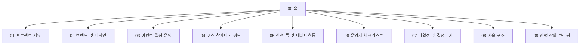

---
tags:
  - orande-run
  - moc
---

# OranDe Run · 기획 볼트

> 비대면 버추얼 런 **제1회** 기획·운영·구현을 한곳에서 점검하는 옵시디언 노트입니다.
> Obsidian에서 이 폴더(`obsidian/`)를 **볼트로 열기** 하면 됩니다.

## 빠른 링크

| 문서 | 용도 |
|------|------|
| [[09-진행-상황-브리핑]] | 지금 어디까지 됐는지 한눈에 |
| [[07-미확정-및-결정대기]] | **직접 채워야 할** 항목 모음 |
| [[06-운영자-체크리스트]] | 모집 전·중·후 할 일 |
| [[03-이벤트-일정-운영]] | 일정·모집 상태·정책 |
| [[05-신청-폼-및-데이터흐름]] | 신청 → 시트 → 입금 흐름 |

## 기획 문서 맵

## 오늘 점검 순서 (추천)

1. [[07-미확정-및-결정대기]] — 날짜·계좌·연락처 확정
2. [[04-코스-참가비-리워드]] — 코스·가격·키캡키링 개수 맞는지
3. [[03-이벤트-일정-운영]] — 모집/참여 기간·인증 규칙
4. [[06-운영자-체크리스트]] — Google Sheets·환경변수 배포
5. [[02-브랜드-및-디자인]] — 화면 카피·금지 패턴

## 코드와 연결

| 설정 파일 | 설명 |
|-----------|------|
| `lib/event-config.ts` | 일정·코스·계좌·문의처 **단일 진실 소스** |
| `DESIGN.md` | 디자인 가이드 (루트) |
| `scripts/google-sheets-webhook.gs` | 시트 연동 스크립트 |

## 태그

- `#확정필요` — 아직 결정 안 됨
- `#배포전` — 코드에 placeholder 남아 있음
- `#운영` — 운영자만 보면 됨
