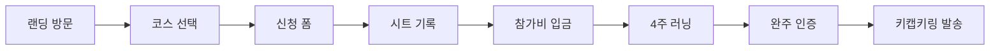

---
tags:
  - orande-run
---

# 프로젝트 개요

관련: [[02-브랜드-및-디자인]] [[03-이벤트-일정-운영]] [[05-신청-폼-및-데이터흐름]]

## 무엇인가?

**OranDe Run (오랜디런)** — 대전 로컬 **제1회** 비대면 버추얼 런 챌린지.

- 각자 원하는 장소·시간에 4주 동안 거리 달리기
- 완주 인증 후 코스별 **키캡키링** 리워드
- 당근 모임에서 시작된 비공식 커뮤니티 러닝

## 핵심 메시지 (3가지)

1. **버추얼 런 / 비대면 마라톤** — 현장 집결 없이 각자 달림
2. **누구나 참여** — 러닝머신·공원·어디서든, 실력 제한 없음
3. **리워드 = 키캡키링** — 코스별 2구 / 3구 / 4구

## 타깃·규모 가정

- [ ] 예상 참가자: ___명 (100명 이하 가정)
- [ ] 주 타깃: 대전 로컬 + 전국 원격 참여자
- [ ] 운영 인원: ___명

## 성공 기준 (직접 정의)

- [ ] 모집 목표 인원: ___
- [ ] 완주율 목표: ___%
- [ ] 키캡키링 발송 완료일: ___

## 참여자 여정 (요약)

상세: [[05-신청-폼-및-데이터흐름]]

## 비즈니스 모델

| 항목 | 내용 |
|------|------|
| 수익 | 참가비 (코스별 5,000 / 7,000 / 10,000원) |
| 비용 | 키캡키링 제작·배송, 호스팅 |
| 결제 | **수동 계좌 이체** (PG 미사용) |

## 경쟁·차별점

일반 오프라인 마라톤 vs 오랜디런 비교는 랜딩 `CompareSection` 및 [[04-코스-참가비-리워드]] 참고.
