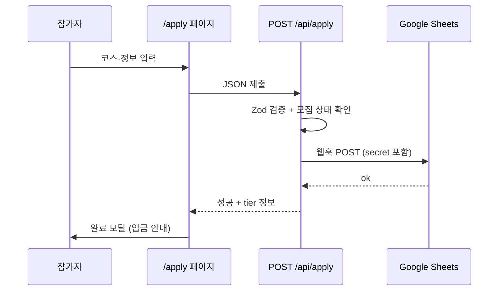

---
tags:
  - orande-run
  - tech
---

# 신청 폼 및 데이터 흐름

관련: [[06-운영자-체크리스트]] [[08-기술-구조]]

## 전체 흐름



## 신청 폼 필드

| 필드 | 필수 | 저장·시트 |
|------|------|-----------|
| 코스 (tierId) | ✅ | 코스명, 참가비 |
| 지역 (cityId + district) | ✅ | `대전/서구` 또는 `대전 외` |
| 이름 | ✅ | 이름 |
| 휴대폰 | ✅ | 휴대폰 |
| 이메일 | 선택 | 이메일 |
| 선호 요일 | 선택 | runningDaysLabel |
| 선호 시간 | 선택 | runningTimePreference |
| 개인정보 동의 | ✅ | privacyConsent: Y |

검증: `lib/apply-schema.ts`

## API 동작 (`app/api/apply/route.ts`)

1. `getRecruitmentStatus() === "closed"` → 403
2. `GOOGLE_SHEETS_WEBHOOK_URL` / `SECRET` 없음 → 500
3. Zod 검증 실패 → 400
4. Sheets 웹훅 실패 → 502

## Google Sheets 스크립트

파일: `scripts/google-sheets-webhook.gs`

### 시트 컬럼 (스크립트 기준)

| 열 | 필드 |
|----|------|
| 제출시각 | submittedAt |
| 이름 | name |
| 휴대폰 | phone |
| 이메일 | email |
| 코스 | tierLabel |
| 참가비 | fee |
| 입금확인 | (운영자 수동) |

> API는 추가로 `locationLabel`, `runningDaysLabel`, `runningTimePreference` 전송 — **시트 헤더에 열 추가 필요** (코드 주석 참고)

### 배포 체크

- [ ] 스프레드시트 생성
- [ ] Apps Script 붙여넣기
- [ ] `WEBHOOK_SECRET` 설정
- [ ] 웹 앱 배포 (실행: 나, 액세스: 모든 사용자)
- [ ] `.env.local` 설정
- [ ] 테스트 신청 1건 → 시트에 행 추가 확인

## 신청 완료 UX

1. `ApplySuccessModal` — 입금 안내
2. 계좌 정보 **복사** 버튼 (`copyPaymentInfo`)
3. `ParticipantGuide` — 5단계 진행 안내
4. `ParticipationPolicyNotes` — 중복·취소 안내
5. `VerificationGuide` — 인증 방법

로컬 저장: `apply-success-storage.ts` (새로고침 후에도 완료 화면 유지)

## 환경 변수

`.env.example`:

```env
GOOGLE_SHEETS_WEBHOOK_URL=https://script.google.com/macros/s/xxxx/exec
GOOGLE_SHEETS_WEBHOOK_SECRET=여기에-임의-시크릿-문자열
```

## 개인정보

동의 요약 (`privacyConsentSummary`):

> 이름, 연락처, 지역, 러닝 계획(선택) 수집·참가 안내·운영 목적, 챌린지 종료 후 1년 보관

- [ ] 보관 기간 1년 OK?
- [ ] 개인정보 처리방침 별도 페이지 필요 여부: ___

## 향후 확장 (지금은 안 함)

- Supabase + 로그인
- PG 자동 결제
- 이메일 자동 발송 (Resend 등)
- API에서 전화번호 중복 차단
